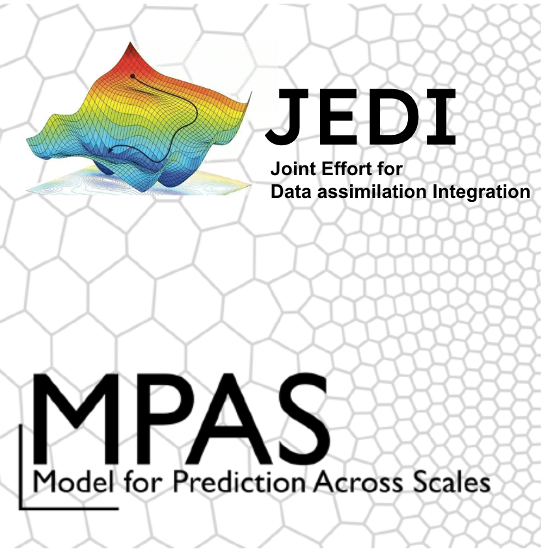

# MPAS+JEDI Cookbook



[](https://github.com/ProjectPythia/mpas-jedi-cookbook/actions/workflows/nightly-build.yaml)
[](https://binder.projectpythia.org/v2/gh/ProjectPythia/mpas-jedi-cookbook/main?labpath=notebooks)
[](https://doi.org/10.5281/zenodo.16797270)

This Project Pythia Cookbook focuses on analyzing, visualizing, and interpreting MPAS model output on the unstructured voronoi mesh, as well as exploring MPAS-JEDI data assimilation results in both the model and observation spaces.   

**Disclaimer:** This cookbook does NOT cover how to run MPAS or JEDI. Readers are encourage to visit [MPAS](https://mpas-dev.github.io/) or [JEDI](https://jointcenterforsatellitedataassimilation-jedi-docs.readthedocs-hosted.com/en/latest/) websites for more details.

## Motivation

[NOAA](https://www.noaa.gov/)'s next generation Rapid Refresh Forecast System ([RRFS](https://github.com/NOAA-EMC/rrfs-workflow/tree/rrfs-mpas-jedi)) is built on the MPAS (Model for Prediction Accross Scals) Model and the JEDI (Joint Effort for Data assimilation Integration) system. While both MPAS and JEDI are powerful tools, they can also be complex to use and interpret. This cookbook will demonstrate how to explore MPAS output and MPAS-JEDI analyses directly on the unstructed voronoi mesh using the [UXarray](https://github.com/UXARRAY/uxarray) package. It also includes examples for examining JEDI analyses in observation space.

## Authors

- [Guoqing Ge (CIRES/NOAA GSL)](https://github.com/guoqing-noaa)
- [Orhan Eroglu (NSF NCAR)](https://github.com/erogluorhan)

### Contributors

<a href="https://github.com/ProjectPythia/mpas-jedi-cookbook/graphs/contributors">
  
</a>

## Structure

This cookbook is broken into three sections:
- Introduction
- MPAS(regional) Analysis and Visualization
- JEDI(MPAS) Analysis and Visulization

### Section 1. Introduction

The introduction part will provide a quick overview about MPAS, JEDI and RRFS(v2).

### Section 2. MPAS (regional) Analysis and Visualization

This part will demonstrate how to make basic and advanced MPAS analysis and visulazation using UXarray.

### Section 3. MPAS-JEDI Analysis and Visualization

This part will demonstrate how to explore MPAS-JEDI data assimilation results in both the model and observation spaces.

## Running the Notebooks

You can either run the notebook using [Binder](https://binder.projectpythia.org/) or on your local machine.

### Running on Binder

The simplest way to interact with a Jupyter Notebook is through [Binder](https://binder.projectpythia.org/), which enables the execution of a [Jupyter Book](https://jupyterbook.org) in the cloud. All you need to know is how to launch a Pythia Cookbooks chapter via Binder. Simply navigate your mouse to the top right corner of the book chapter you are viewing and click on the rocket ship icon, and be sure to select “launch Binder”. After a moment you should be presented with a notebook that you can interact with. I.e. you’ll be able to execute and even change the example programs. You’ll see that the code cells have no output at first, until you execute them by pressing {kbd}`Shift`\+{kbd}`Enter`. Complete details on how to interact with a live Jupyter notebook are described in [Getting Started with Jupyter](https://foundations.projectpythia.org/foundations/getting-started-jupyter.html).

Note, not all Cookbook chapters are executable. If you do not see the rocket ship icon, such as on this page, you are not viewing an executable book chapter.

### Running on Your Own Machine

If you are interested in running this material locally on your computer, you will need to follow this workflow:

1. Clone the `https://github.com/ProjectPythia/mpas-jedi-cookbook` repository:

   ```bash
    git clone https://github.com/ProjectPythia/mpas-jedi-cookbook
   ```

1. Move into the `mpas-jedi-cookbook` directory
   ```bash
   cd mpas-jedi-cookbook
   ```
1. Create and activate your conda environment from the `environment.yml` file
   ```bash
   conda env create -f environment.yml
   conda activate mpas-jedi-cookbook
   ```
1. Move into the `notebooks` directory and start up Jupyterlab
   ```bash
   cd notebooks/
   jupyter lab
   ```
